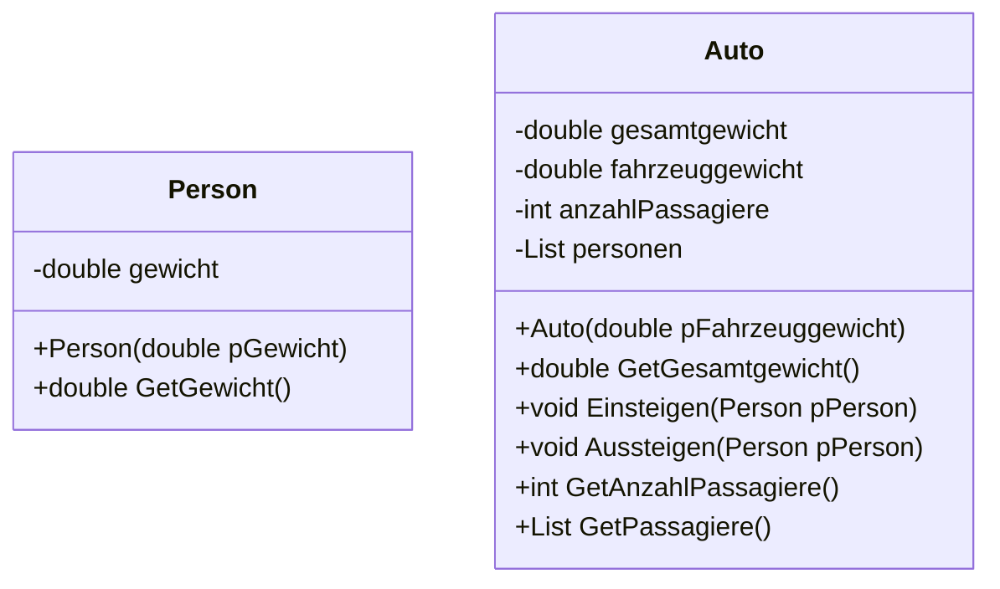

# Pojekt Auto-Person-Gewicht (Markus, Manuel)
## Überblick
Das C#-Programm AutoPersonGewicht, enthält eine Klasse Auto, die das Gewicht eines Fahrzeugs sowie die Passagiere, die in das Fahrzeug ein- oder aussteigen, verwaltet.
## Klassenbeschreibung 
### Klassendiagramm

## Auto.cs
### Attribute
gesamtgewicht: Ein privates Feld vom Typ double, das das Gesamtgewicht des Autos speichert (Fahrzeuggewicht plus das Gewicht aller Passagiere).
fahrzeuggewicht: Ein privates Feld vom Typ double, das das Gewicht des Fahrzeugs ohne Passagiere speichert.
anzahlPassagiere: Ein privates Feld vom Typ int, das die Anzahl der Passagiere im Auto speichert.
person: Eine private Liste vom Typ List<Person>, die alle Passagiere speichert, die sich im Auto befinden.
### Konstruktoren
Auto(): Ein parameterloser Konstruktor, der ein Auto-Objekt erstellt.
Auto(double pFahrzeuggewicht): Ein Konstruktor, der das Fahrzeuggewicht als Parameter akzeptiert und das Gesamtgewicht auf das Fahrzeuggewicht setzt.
### Methoden
double GetGesamtgewicht(double pFahrzeuggewicht, Person pPerson): Diese Methode berechnet das Gesamtgewicht des Autos, indem sie das Fahrzeuggewicht und das Gewicht einer angegebenen Person addiert. Sie gibt das berechnete Gesamtgewicht zurück.
void Einsteigen(Person pPerson): Diese Methode fügt eine Person zur Liste der Passagiere hinzu.
void Aussteigen(Person pPerson): Diese Methode entfernt eine Person aus der Liste der Passagiere.
int GetAnzahl(): Diese Methode gibt die Anzahl der Passagiere im Auto zurück.
List<Person> GetPassagiere(): Diese Methode gibt die Liste<Person> Passagiere zurück.
### Verwendung
Die Klasse Auto wird verwendet, um das Gewicht eines Fahrzeugs und die Passagiere zu verwalten. Man kann Passagiere ein- und aussteigen lassen und das Gesamtgewicht des Autos basierend auf dem Gewicht des Fahrzeugs und der Passagiere berechnen.

## Personen.cs
### Attribute
gewicht: Ein privates Feld vom Typ double, das das Gewicht einer Person speichert.
### Konstruktoren
Person(double pGewicht): Ein Konstruktor, der das Gewicht der Person als Parameter akzeptiert und das gewicht-Feld entsprechend setzt.
### Methoden
double GetGewicht(): Diese Methode gibt das Gewicht der Person zurück.
### Verwendung 
Die Klasse Person wird verwendet, um das Gewicht von Passagieren zu verwalten, die in das Auto ein- und aussteigen.

Datum | Bearbeiter | Beschreibung
-------- | -------- | --------
23.05.24 | Markus | Erste Programmversion veröffentlich, Klassendiagramm samt Klassen (Auto, Person) und erste Methoden implementiert
23.05.24 | Manuel | Anfängliche ReadMe erstellt, Beschreibung der Klassen und grundsätzlichen Funktion
23.05.24 | Markus | Zweite Programmversion : Passagiere können ein- und aussteigen und das Gewicht wird berechnet & ausgegeben. Diese Änderungen auch auf die ReadMe übernommen
